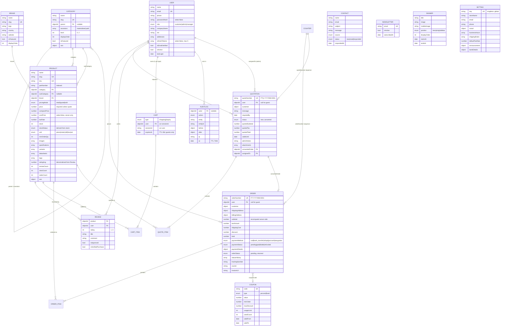

# Fast Traders — Data Model (Phase 2)

15 Mongoose models (14 domain + 1 internal `Counter`). Every entity interface is
duplicated in `server/src/types/` and `client/src/types/` — those two directories
must be kept in sync.

---

## ER diagram



---

## Relationships at a glance

| From | Cardinality | To | Field | Notes |
| --- | --- | --- | --- | --- |
| Category | 1 → many | Category | `parent`, `ancestors[]` | Self-referential, max depth 2 (3 levels). `ancestors` is a materialised path so a whole subtree is one query. |
| Category | 1 → many | Product | `category`, `subCategory` | `category` is the level-1 node, `subCategory` the level-2 node. |
| Brand | 1 → many | Product | `brand` | Required. |
| Product | 1 → many | Review | `product` | `ratingAvg` / `reviewCount` denormalised onto Product by a post-save hook. |
| User | 1 → many | Order / Quotation / Review | `user` | Nullable on Order and Quotation — guest checkout and guest RFQ are both supported. |
| User | 1 → 0..1 | Cart | `user` + `type` | Partial unique index, so exactly one shopping cart and one inquiry cart per user. |
| User (admin) | 1 → many | Quotation | `assignedTo` | Sales ownership of an RFQ. |
| Quotation | 1 → 0..1 | Order | `convertedOrder` | Set when an accepted quote is converted. |
| Order / Quotation | 1 → many | items[] | embedded | Product data is **denormalised** into each line so history survives catalogue edits. |
| Counter | 1 → many | Order / Quotation | `_id: "order:YYYYMM"` | Atomic `$inc` upsert generates `FT-…` / `FTQ-…` numbers without collisions. |
| User | 1 → many | AuditLog | `actor` | Nullable for system actions (webhooks, cron). |

**Deliberately unrelated:** `Contact`, `Newsletter`, `Banner` and `Setting` are
standalone. `Setting` is a singleton enforced by `key: 'global'` + unique index.

---

## The hybrid commerce path

```
Product.pricingMode
  ├─ "retail" ─┐
  ├─ "both"  ──┼─► Cart(type:"shopping") ─► Order ─► Payment ─► statusHistory[]
  │            │
  ├─ "both"  ──┤
  └─ "quote" ──┴─► Cart(type:"inquiry")  ─► Quotation ─► admin prices lines
                                                        ─► customer accepts
                                                        ─► convertedOrder → Order
```

Two schema-level guards enforce this:

- `Product.price` is `required` unless `pricingMode === 'quote'`.
- Virtuals `isBuyable` (`pricingMode !== 'quote' && isActive && stock > 0`) and
  `isQuotable` (`pricingMode !== 'retail' && isActive`) give the API and UI a
  single source of truth for which button to render.

---

## Index summary

| Model | Indexes |
| --- | --- |
| User | `email` UK · `role` · `isActive` · `{role,isActive}` · `{createdAt:-1}` · text `{name,email,companyName}` |
| Category | `slug` UK · `parent` · `level` · `isFeatured` · `isActive` · `{parent,displayOrder}` · `ancestors` · `{isActive,isFeatured,displayOrder}` |
| Brand | `slug` UK · `isFeatured` · `isActive` · `{isActive,displayOrder}` · text `{name}` |
| Product | `slug` UK · `sku` UK · `partNumber` · text `{sku:20, partNumber:20, name:10, tags:5, description:1}` (weighted — trade buyers paste part numbers) · `{category,brand,isActive}` · `{subCategory,isActive}` · `{isActive,isFeatured,createdAt:-1}` · `{pricingMode,isActive}` · `{price,isActive}` · `{salesCount:-1}` |
| Order | `orderNumber` UK · `{user,createdAt:-1}` · `{orderStatus,createdAt:-1}` · `{paymentStatus,orderStatus}` · `{customer.email,createdAt:-1}` |
| Quotation | `quoteNumber` UK · `{status,createdAt:-1}` · `{user,createdAt:-1}` · `{customer.email,createdAt:-1}` · `{assignedTo,status}` · `validUntil` |
| Cart | `{user,type}` UK *(partial)* · `{sessionId,type}` UK *(partial)* · `expiresAt` **TTL 30d** |
| Review | `{product,user}` UK · `{product,isApproved,createdAt:-1}` |
| Coupon | `code` UK · `{isActive,validFrom,validTo}` |
| Contact | `{status,createdAt:-1}` · `{email,createdAt:-1}` · `source` |
| Newsletter | `email` UK |
| Banner | `{position,isActive,displayOrder}` |
| Setting | `key` UK (singleton) |
| AuditLog | `{entity,entityId,at:-1}` · `{actor,at:-1}` · `at` **TTL 730d** |

---

## Hooks & derived data

| Model | Hook | Effect |
| --- | --- | --- |
| User | `pre('save')` ×3 | bcrypt hash (12 rounds) on password change · exactly one default address · refresh-token list capped at 5 |
| Category | `pre('save')` | Materialises `ancestors` + `level` from the parent chain; rejects nesting beyond 3 levels |
| Product | `pre('save')` ×3 | Derives `stockStatus` from `stock`/`lowStockThreshold` (respecting a manual `on_order`) · forces one primary image · fills SEO defaults |
| Order | `pre('validate')` | Assigns `FT-YYYYMM-0001` and opens `statusHistory` |
| Order | `pre('save')` ×2 | Recomputes line subtotals and `total` server-side (client figures are never trusted) · appends to `statusHistory` on status change |
| Quotation | `pre('validate')` | Assigns `FTQ-YYYYMM-0001` |
| Quotation | `pre('save')` | Recomputes `quotedSubtotal` / `quotedTotal` from priced lines |
| Cart | `pre('validate')` | Enforces owner XOR (`user` or `sessionId`, never both) and refreshes the 30-day guest TTL |
| Review | `post('save')`, `post('findOneAndDelete')` | Recomputes `Product.ratingAvg` / `reviewCount` from approved reviews only |
| Contact | `pre('save')` | Stamps `respondedAt` when status becomes `responded` |
| Newsletter | `pre('save')` | Stamps / clears `unsubscribedAt` |

---

## Data exposure rules

Three fields are `select: false` and must never reach a public response:

- `User.passwordHash`
- `User.refreshTokens`, `emailVerifyToken`, `resetPasswordToken`, `resetPasswordExpiry`
- `Product.costPrice`

`costPrice` is also absent from the client-side `Product` interface, so a leak
would be a type error, not just a policy breach.

---

## Seed contents

`npm run seed` (idempotent; `npm run seed:destroy` reverses it):

| Data | Count | Detail |
| --- | --- | --- |
| Admin user | 1 | `fasttrad3rs@gmail.com` — password from `SEED_ADMIN_PASSWORD`, or generated and printed once |
| Brands | 12 | The client's authorised list, with country of origin and real descriptions |
| Categories | 38 | 7 roots → 22 level-1 → 9 level-2 (e.g. Switchgear & Protection › Circuit Breakers › MCCB) |
| Products | 52 | 25 `retail`, 11 `both`, 16 `quote` — real part numbers and 4–7 technical specs each |
| Banners | 3 | 2 hero + 1 strip |
| Settings | 1 | Real contact details, Lahore/Punjab/nationwide shipping rules, 18% GST, business hours |

Product imagery uses `placehold.co` placeholders keyed by SKU; replace with
Cloudinary assets in the admin panel before launch.
